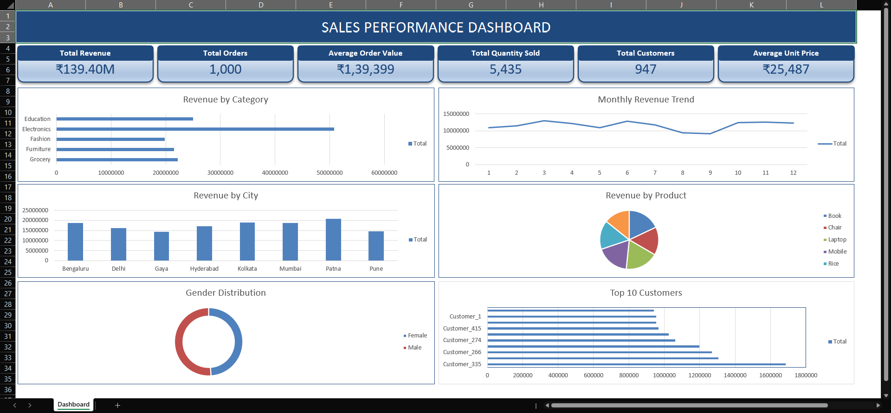

# Exploratory Data Analysis (EDA) & Business Intelligence Dashboard

## ApexPlanet Internship – Task 2

This project was completed as part of the **ApexPlanet Data Analytics Internship**. The objective was to perform Exploratory Data Analysis (EDA) on a sales dataset, generate business insights, and create an executive dashboard in Microsoft Excel.

---

## Project Overview

The project includes:

- Data exploration using Python
- Statistical analysis
- Sales trend analysis
- SQLite database creation
- Business queries using SQL
- Executive Dashboard in Microsoft Excel

---

## Tools & Technologies

- Python
- Pandas
- Matplotlib
- SQLite
- Microsoft Excel
- Pivot Tables
- Pivot Charts

---

## Dataset Information

The dataset contains **1000 sales records** with **16 columns**, including:

- Order ID
- Order Date
- Customer Information
- Product Details
- Category
- Quantity
- Unit Price
- Total Sales

The dataset was cleaned during Task 1 before performing EDA.

---

## Dashboard Preview



---

## Project Structure

```text
02-Exploratory Data Analysis (EDA) & Business Intelligence/

├── CSV Files/
├── Screenshots/
├── Cleaned_ApexPlanet_DataAnalytics_Dataset.xlsx
├── Sales_Database.db
├── SQL_Results.xlsx
├── EDA_Analysis.py
├── SQL_Analysis.py
├── EDA_Report.md
└── README.md
```

---

## Key Business Insights

- Electronics generated the highest revenue.
- Patna was the highest revenue-generating city.
- Laptop and Mobile were the top-performing products.
- Male and Female customer contributions were nearly equal.
- Unit Price showed the strongest correlation with Total Sales.
- Revenue remained relatively stable throughout the year.

---

## Dashboard Features

- Total Revenue
- Total Orders
- Average Order Value
- Total Quantity Sold
- Total Customers
- Average Unit Price
- Revenue by Category
- Revenue by City
- Monthly Revenue Trend
- Revenue by Product
- Gender Distribution
- Top 10 Customers

---

## Conclusion

This project demonstrates practical skills in Python, SQL, data visualization, and business intelligence using Microsoft Excel. The dashboard provides meaningful insights that support data-driven decision-making.
